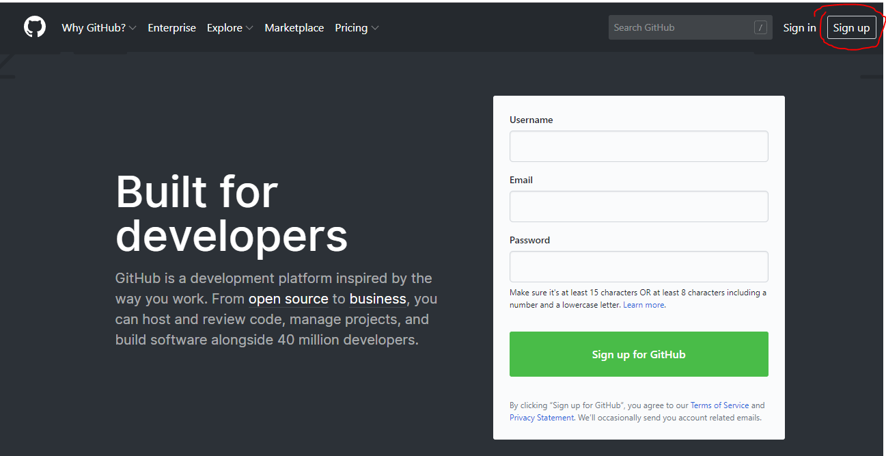
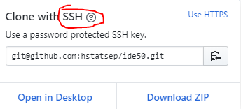
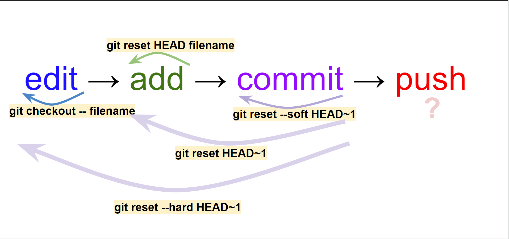

# GitHub Tutorial

by Hengsheng Liu 

---
## Git vs. GitHub
**Git (Local) :** is a local version control system that's installed inside of the IDE(Integrated development environment). It takes snap-shot of your code and record its history so the developer could track the changes and revert it at any time.

**GitHub (Remote):** is a remote server that store the user's code. It is mainly use by developers to collaborate with his/her coworkers. 

**Git Vs. GitHub**

*   Git is a local place that saves code and Github is a remote place that saves the code on a server
*   GitHub does require Git but Git doesn't require GitHub
*   Git is use for track changes and GitHub is used for storage code also visually representation for changes
*   Developers could work together in GitHub and merge to a master branch but Git can't do that. 

---
## Initial Setup

Log into the [Github website](https://github.com/) to create a GitHub accout


Here is a good link of how to connect Github with IDE
[Setup IDE](https://github.com/hstatsep/ide50)

When **forking** or **cloning**, make sure using **SSH** not HTTPS because HTTPS have to check your identity and you have to type password and username everytime. on the other side, **SSH** doesn't require it. 



---
## Repository Setup
When you want initialize Git inside your folder
1. **Git init** - Initilaized Git inside the folder and the folder should change from xxx/xxx to xxx/xxx/(Master)
2. **Git add .** - Add the current working directory to the staging area and you should see something like this
3. Recommend to type **git status** to check the status of the file
4. When you typed in **git status** and the file is ready for committing. Git status will like this
 ```bash
On branch master
Your branch is up to date with 'origin/master'.

Changes to be committed:
  (use "git reset HEAD <file>..." to unstage)

        modified:   README.md

```
 If is not added to the stage, Git Status will show like this
```bash
On branch master
Your branch is up to date with 'origin/master'.

Changes not staged for commit:
  (use "git add <file>..." to update what will be committed)
  (use "git checkout -- <file>..." to discard changes in working directory)

        modified:   README.md

no changes added to commit (use "git add" and/or "git commit -a")
```
5. **Git commit -m "message"** - Take a ‘snapshot’ of the files on the stage.  The message should be present-tense and describe what was modified in this snapshot (‘create HTML template”)
6. Personal choice - could type git status to check again.
7. **Git push** - push the version to a remote server like GitHub. 

## Set up remote
1. **Git remote add origin URL** - Set up connection between local IDE and a remote server. URL = SSH 
2. **Git push -u origin master** - First time pushing the changes to a remote but after the first time you could just type **git push** to push the changes. 
3. **Git remote -v** - could you where is the committs send to. 
```bash
origin  git@github.com:hengshengl7714/github-tutorial.git (fetch)
origin  git@github.com:hengshengl7714/github-tutorial.git (push)
```


---
## Workflow & Commands
**Workflow**
1. editing inside of the repo 
2. type **git status** to see whether the file is modified or not(it should be in red).
3. type **git add .** to add the changes to the stage so the file is ready to commit.
4. type **git status** to see whether the file is added to the stage or not(now it should be green).
5. type **git commit -m "message"** to commit the change and Git will save a record of the change 
6. type **git staus** it should say nothing to commit and say you're ahead of your remote repo x times 

```bash
[master 56c1b57] add workflow
 1 file changed, 8 insertions(+), 2 deletions(-)
~/github-learning/github-tutorial/ (master) $ git status 
On branch master
Your branch is ahead of 'origin/master' by 1 commit.
  (use "git push" to publish your local commits)

nothing to commit, working tree clean
```

7. type **git push** to push the commit to your remote(GitHub).


---
## Rolling Back Changes
**git reset --hard HEAD~1** - Undo all the changes after committed the change.  
**git reset --soft HEAD~1** - Undo the commit after committed the change.  
**git reset HEAD~1** - Undo both the commit and the add after committed the change.  
**git reset HEAD filename** - Undo the adding after added to the stage area.  
**git checkout -- filename** - Undo the all the editing before adding



---
## Error handling 
* How to remove from a directory? -- inside the directory type **rm -rf .git** 
* How to remove a repo locally? -- go to the parent folder of the repo and type **rm -rf [folder name]**
* How to remove a repo remotelly? 
    1. go to your remote website (GitHub) 
    2. go to the repo that you want remove. 
    3. go to setting. 
    4. scroll down and click **Delete this repository**.

---
## Cloning Vs. Forking
* Clone - When you clone someone's repo on GitHub, you're using the SSH link to upload their remote repo to your local IDE and when you push the work to the remote, the work is push to the **owner's remote**. You need the permission to the the changes.   
* Fork  - When you fork someone's repo on GitHub, you're making your **own** remote out of the owner's **remote**. 

What if you want to work on someone else's work and have your own remote to push the changes?
1.  You have to **fork** their repo to make a your own repo.

2. Log into your Local IDE
3. CD into the parent folder where you want to make the repo
4. Type **Git clone URL** (to clone the remote to your local IDE)

What if you want to work on someone else's work and the changes will happen on the Owner's repo
1. **Fork** the owner's repo.
2. **Clone** your repo to the **Local IDE**.
3. Make changes on your own local IDE (Add and Commit). 
4. push the changes to the remote(Git push).
5. Log into Github.com.
6. Click the repo.
7. Click **New pull request**.

8. Click **Create new pull requests**.

9. Wait for approve : ). 